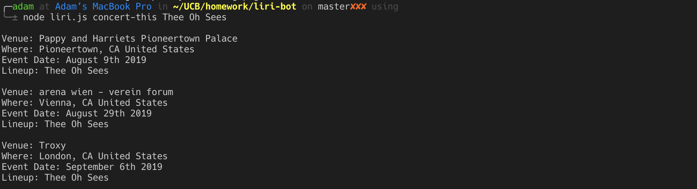
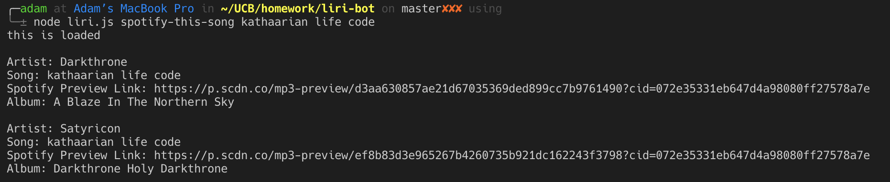
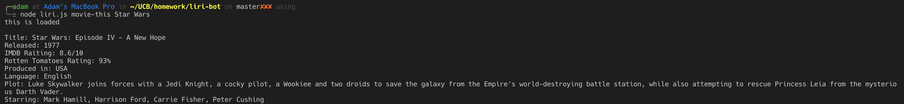

# LIRI-Bot

## **Overview**

This assignment was completed as a homework during the UC Berkeley Extension's Full Stack Bootcamp. We were challenged to leverage our newly acquired Node.js skills in order to create an application which retrieves the following on command.

* Upcoming concert dates for a specified artist
* Spotify search results for a specified song
* Details from a specified movie

---
## **Installation**
1. From terminal or git-terminal, navigate to your desired download directory and run the following:

    >`git clone https://github.com/ahydorn/liri-bot.git`

2. After installation, navigate inside the newly downloaded folder and run `npm install`
3. When complete, run `node liri.js` or one of the following commands without quotation marks:
   > * `concert-this <artist name>`
    >* `spotify-this-song <song title>`
    >* `movie-this <movie name>`
---    

## **Command Usage**

### **Find Upcoming Concerts Using BandsInTown**

>`node liri.js concert-this <artist name>`

Displays upcoming concerts with the following details in Terminal:
* Venue
* Location
* Event Date
* Lineup

### **Find a Song using the Spotify API**

>`node liri.js spotify-this-song <song name>`

Returns the following information in Terminal:

* Artist(s)
* Song title
* Spotify preview link
* The album on which the song appears

*If no track is specified, it will default to "Daly City Train" by Rancid.*

### **Find a movie using the OMDB API**

>`node liri.js movie-this <movie name>`

Shows the following information in Terminal:

* Movie title
* Release year
* IMDB rating
* Rotten Tomatoes rating
* Country of production
* Plot synopsis
* Actors

*If no movie is specified, it will default to "Bad Santa"*

### **Find a movie using text from a file**

>`node liri.js do-what-it-says`

Uses text found in the file, `random.txt` and queries it using spotify-this-song

---

## **Tech Used**
* Node.js
* Axios
* Node Spotify API
* OMDB API
* BandsInTown API
* Moment.js
* jQuery
* GitHub

**Created by Adam Hydorn for UC Berkeley Extension Full Stack Bootcamp, 2019**
